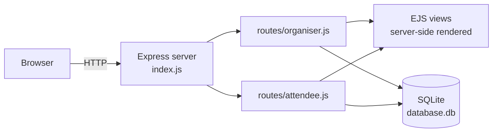

# Iron Forge Events: Event Booking Web App

A full-stack **event management and ticket booking** application built with **Node.js, Express, EJS and SQLite**. Organisers create and publish events with limited ticket allocations. Attendees browse upcoming events, book tickets, and look up or cancel their bookings.

The demo is themed around *Iron Forge Lifting*, a weight-lifting club running sessions for all levels, but the site name and description can be changed from the organiser settings page.


---

## Features

### Organiser portal (`/organiser`)
- **Dashboard** listing *draft* and *published* events, with tickets sold vs. available for each
- **Create** a new event (starts as a draft, defaulting to one week out at 18:00)
- **Edit** title, description, date/time, ticket quantities and prices
- **Two ticket types**: full price and concession (student), each with its own quantity and price
- **Publish** drafts to make them visible to attendees, or **delete** events
- **Site settings**: change the site name and description shown across the app

### Attendee portal (`/attendee`)
- Browse all **published events**, sorted by date
- Open an event to see its details and **remaining tickets**, then **book** with name and email validation
- **Double-booking protection**: one active booking per email per event
- **My Booking** lookup by booking reference and email
- **Cancel** a booking, which frees the tickets back to the event's availability

## How it works



- **Server-side rendering**: every page is an EJS template rendered by Express, with shared header and footer partials. There is no front-end framework or bundler.
- **Data layer**: a single SQLite file accessed through `sqlite3` with **parameterised queries**, which guards against SQL injection.
- **Integrity in the database**: foreign keys (with `ON DELETE CASCADE`), `CHECK` constraints on non-negative quantities and prices, and a `UNIQUE (event_id, attendee_email, is_active)` constraint back up the application-level validation.
- **Money stored as integer cents** to avoid floating-point rounding errors.
- **Soft cancellation**: a cancelled booking is flagged `is_active = 0` with a timestamp rather than deleted, so history is preserved.
- **Availability is calculated live** by summing active bookings against each event's ticket totals.

### Database schema

| Table | Purpose |
|---|---|
| `site_settings` | Single-row table (enforced by `CHECK (settings_id = 1)`) holding the site name and description |
| `events` | Title, description, date/time, `draft`/`published` state, ticket totals and prices (in cents) for both ticket types |
| `bookings` | Attendee name/email, quantities per ticket type, active/cancelled status; linked to `events` by foreign key |

Full definition: [`db_schema.sql`](db_schema.sql)

## Getting started

**Requirements:** Node.js 16+ and npm 8+

```bash
git clone https://github.com/martinsnyman/event_handler.git
cd event_handler

npm install
npm run build-db   # creates database.db from db_schema.sql
npm start          # starts the server on port 3000
```

Then open:

| URL | Page |
|---|---|
| http://localhost:3000/ | Landing page |
| http://localhost:3000/organiser | Organiser dashboard |
| http://localhost:3000/attendee | Attendee home |

**Reset the database:** `npm run clean-db && npm run build-db`
**Use a different port:** `PORT=4000 npm start`

## Project structure

```
event_handler/
├── index.js              # Express app setup, DB connection, error handling, graceful shutdown
├── db_schema.sql         # Tables, constraints, indexes and default settings
├── routes/
│   ├── organiser.js      # Dashboard, create/edit/publish/delete events, site settings
│   └── attendee.js       # Event listing, booking, lookup and cancellation
├── views/                # EJS templates (+ shared partials)
├── public/main.css       # Plain CSS styling
└── scripts/              # build-db / clean-db helpers
```

## Possible improvements

- Authentication for the organiser portal (currently open, as it's a local demo)
- Email confirmation of bookings
- Automated tests for the booking and availability logic

## Acknowledgements

Built for a university web development module (CM2040 *Databases, Networks and the Web*), starting from the course-provided Express/SQLite template.

---

**Author:** Martin Snyman · [GitHub](https://github.com/martinsnyman)
